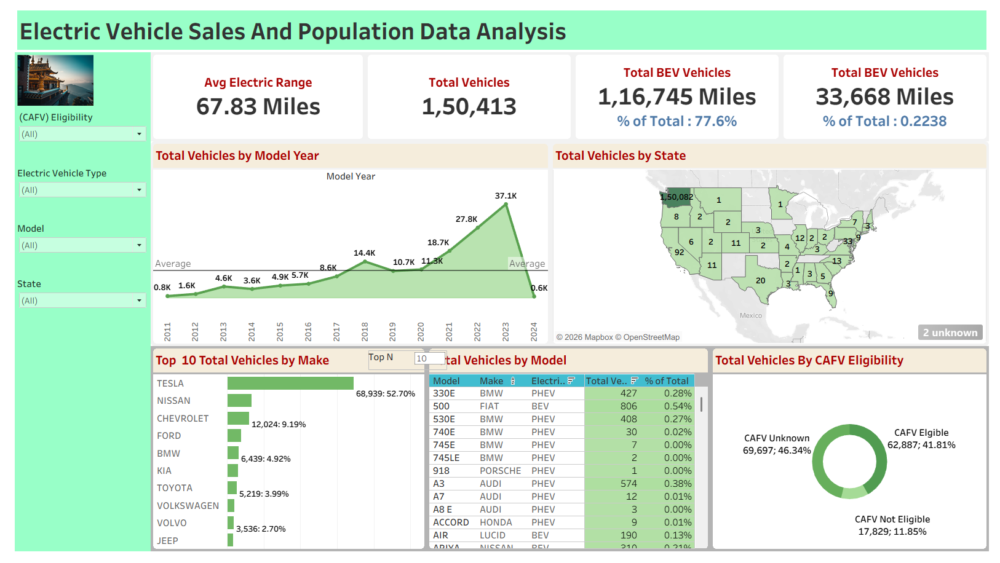

# Electric Vehicle Sales & Population Dashboard

A Tableau dashboard built to explore electric vehicle adoption trends using vehicle population data. The project focuses on battery electric vehicles (BEVs), plug-in hybrid electric vehicles (PHEVs), model popularity, manufacturer trends, and geographic distribution.

## Project Overview

The dashboard was created to make EV data easier to understand through interactive charts and KPI cards. It helps identify:

- Growth of electric vehicles over time
- Most popular vehicle brands and models
- Distribution of EVs across states
- CAFV eligibility trends
- Average electric driving range
- Share of BEV vs PHEV vehicles

## Dashboard Features

### KPI Cards
- Total Vehicles
- Total BEV Vehicles
- Total PHEV Vehicles
- Average Electric Range

### Visualizations
- Total Vehicles by Model Year
- Top 10 Vehicle Makes
- Total Vehicles by Model
- CAFV Eligibility Breakdown
- State-wise EV Distribution

## Tools Used

- Tableau
- Excel / CSV Dataset
- Data Cleaning and Transformation

## Dataset

The project uses electric vehicle population data containing information such as:

- Vehicle Make
- Vehicle Model
- Electric Range
- Model Year
- Vehicle Type
- State
- CAFV Eligibility

## File Included

- `EV_DashBoard.twb` – Tableau Workbook File

## How to Open the Project

1. Install Tableau Desktop or Tableau Public.
2. Download the `.twb` file from this repository.
3. Open the file using Tableau.
4. Connect the dataset if Tableau asks for the data source location.

## Insights from the Dashboard

- BEV vehicles make up the majority of registered EVs.
- Tesla appears among the leading EV manufacturers.
- EV registrations increased significantly after recent model years.
- Certain states show much higher EV adoption compared to others.

## Screenshot

Add dashboard screenshots here after uploading them to the repository.

```md

